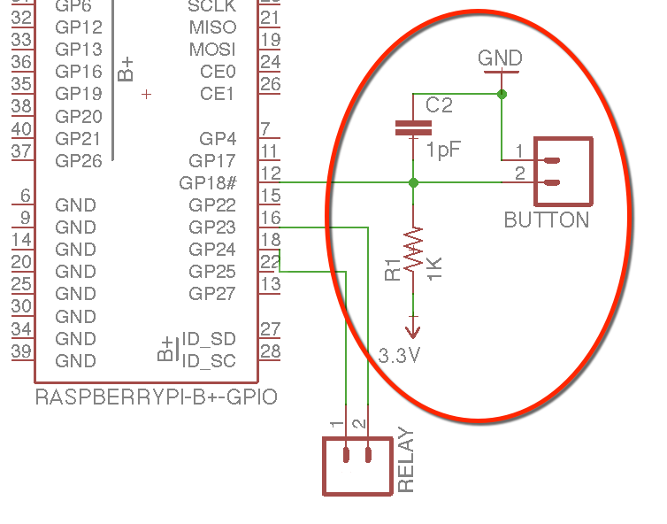

# Emergency button for the 3D printer (via RPi) 




use shielded cable for the button. this, together with the capacitor will help with interferences. last thing you need is fake emergency stops :D


- GPIO 2 connects via a simple wire to the RESET pin of the printer board

- GPIO 24 is connectd to a replay that swithces on/off the 24V power for the printer

##running as service service 

`chmod +x emergency_stop.py`

create file `/lib/systemd/system/emergency_stop.service` with:

```
[Unit]
Description=EmergencyStop
After=syslog.target

[Service]
ExecStart=/home/pi/emergency_stop.py
Restart=always

[Install]
WantedBy=multi-user.target
```

then execute

```
systemctl daemon-reload 
systemctl enable emergency_stop.service
```

## other options

- run from command line (called from octoprint system menu)
`sudo /home/pi/emergency_stop.py run`

- reset the printer board only
`sudo /home/pi/emergency_stop.py reset`


#More....


_This is part of a integrated solution to create a smooth 3D printing experience by "gluing" the individual software and hardware players_

##Simplify3D - the slicer

Models (downloaded or created by Fusion360) are loaded and sliced based on selected material/quality/extruder-nozzle combo.

The "auto-select" `material` and `extruders` have names that will eventually be displyed in the "Info" tab of the mobile octoprint

The "Starting Script" ends with `"; ------------ START GCODE ----------"`. This will be used later.

Once the code file gets generated, Simplify3D executes the postprocessing sequence 

```
{REPLACE "; layer" "M808 zchange Layer"} 
{REPLACE " Z = " " "}
/full_path_to/toctoprint.py  trash select estimate --gcode "[output_filepath]"
```

See https://github.com/MoonshineSG/Simplify3D-to-OctoPrint

Estimations provided by https://github.com/MoonshineSG/marlin-estimate. _Currently not very accurate._

## RaspberryPi - the brain 

runs Octoprint and has a couple of opto relays connected to the GPIO pins as well as direct control over the reset PIN 
of the 3D printer board (see  https://github.com/MoonshineSG/emergency-button).

## Octoprint - the controler 

A few plugins assist the main software:

* replacemnt UI for octoprint on mobile devices mobile https://github.com/MoonshineSG/OctoPrint-Mobile

* GPIO are controlled by https://github.com/MoonshineSG/OctoPrint-Switch

* MP3 sounds https://github.com/MoonshineSG/OctoPrint-Sound

* additional tiny helpers https://github.com/MoonshineSG/OctoPrint-Plugins

## Marlin - the firmware

customised firmware with additional commands

* M808: echo parameters as `//action:`

* M889: cooling fan for end of print sequence (works with `TEMP_STAT_LEDS`)

around line #8372
```
digitalWrite(STAT_LED_BLUE, new_led ? LOW : HIGH);
if (! new_led ) {
  enqueue_and_echo_commands_P(PSTR("M889 C0"));
  SERIAL_PROTOCOLLN("//action:cooled");
}

```

* M890: swappable extruder (see https://github.com/MarlinFirmware/Marlin/issues/3980)

_All changes available at_ https://github.com/MoonshineSG/Marlin

## Opto relays the workers
used as printer power and IR lights switches